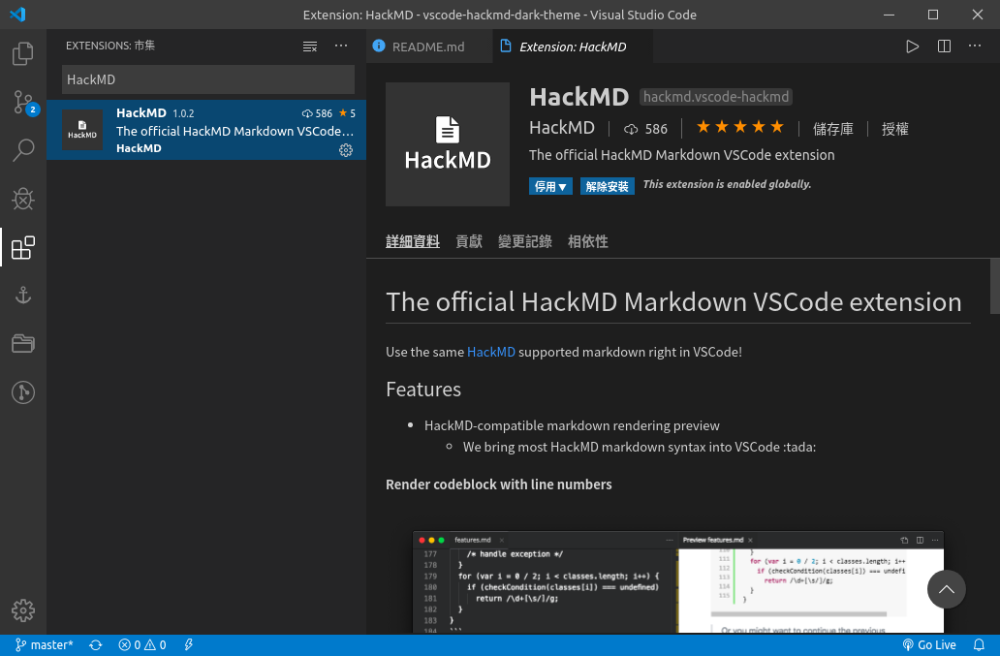
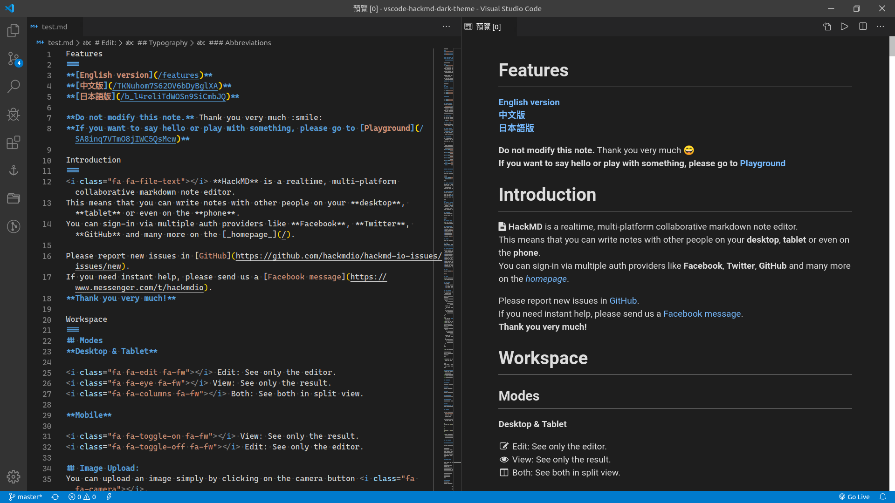
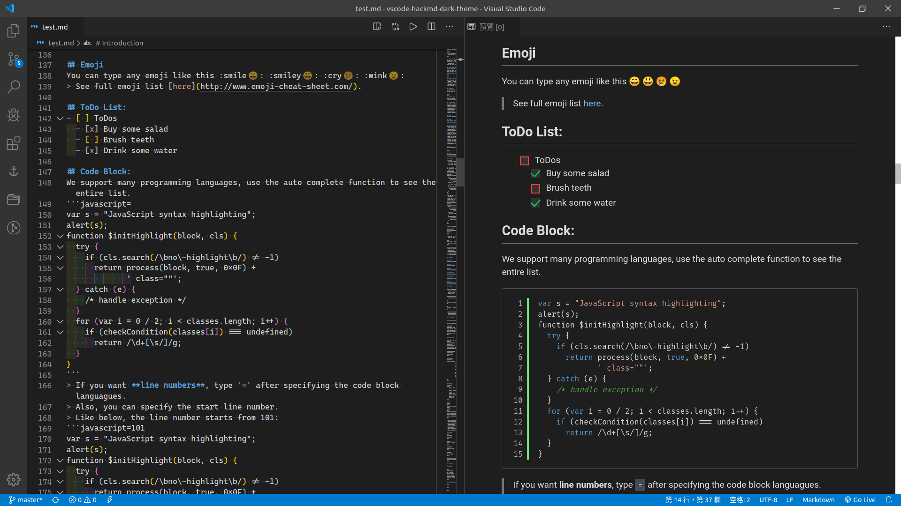
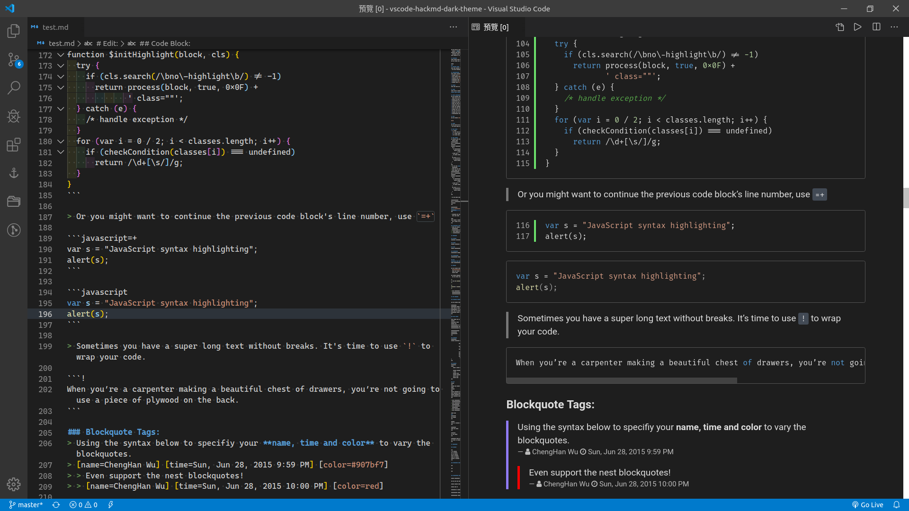
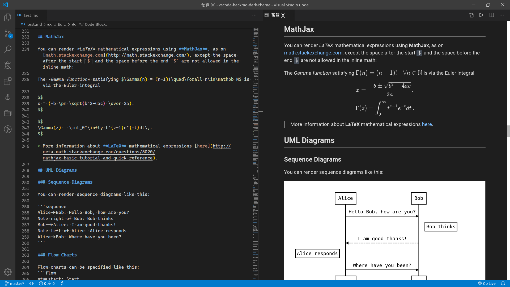
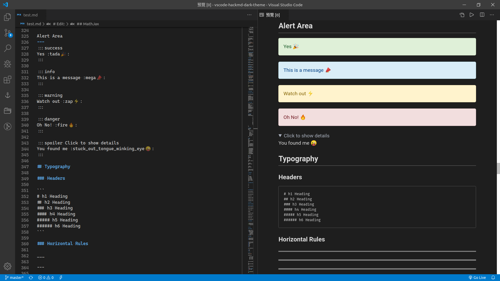
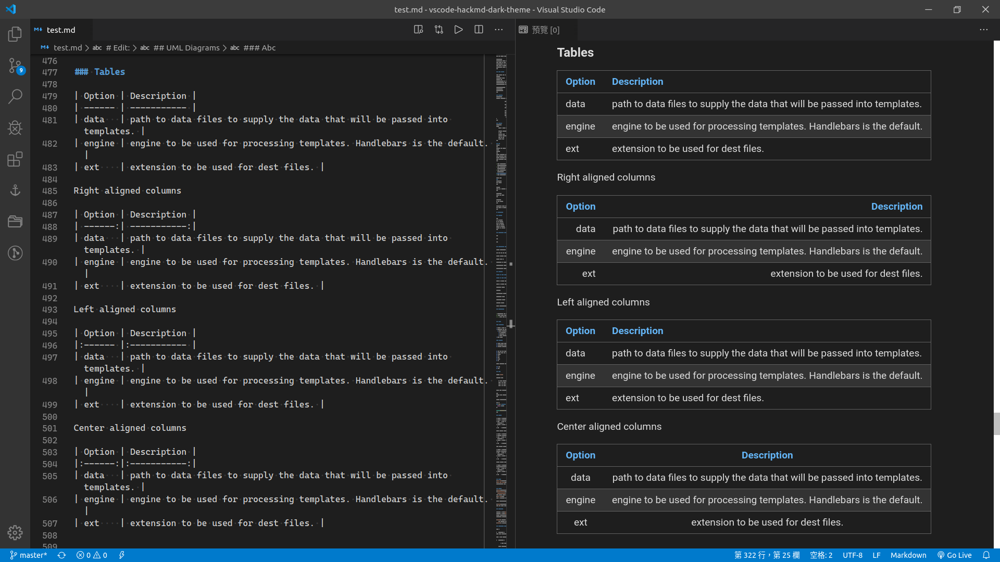
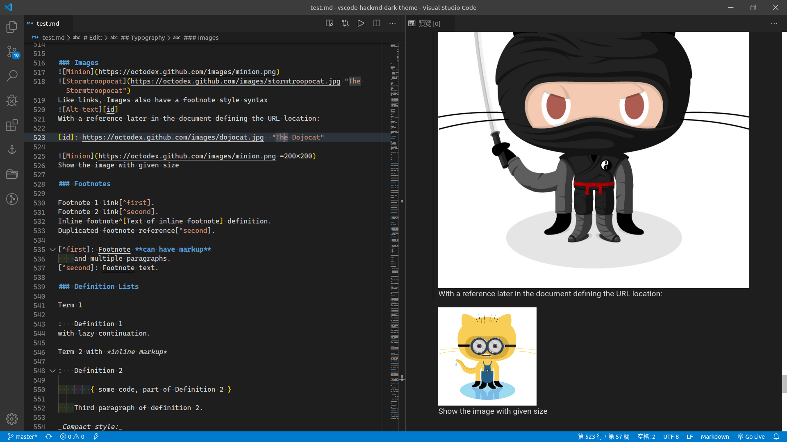
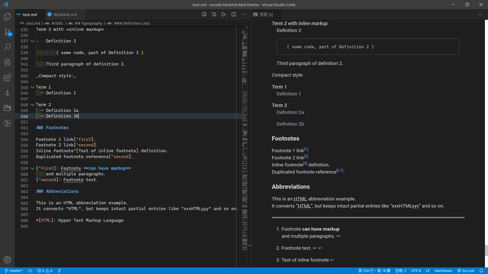

# vscode-hackmd-dark-theme

Dark theme for [HackMD VScode extension](https://marketplace.visualstudio.com/items?itemName=HackMD.vscode-hackmd)

## Installing



## Usage

The theme of the Markdown preview can be specified by `"markdown.styles": []` settings. Stylesheets can be URLs, relative paths to the current workspace, or local absolute paths.

Edit `Settings.json` (**File > Preferences > Settings**) like below:

```json
{
  "markdown.styles": [
    "[YOUR_PATH]/hackmd-theme-dark.css",
  ]
}
```

## Screenshots



### Emoji & Todo list & Code block highlight



### Code block highlight & Blockquote Tags



### LaTeX & UML



### Alert Area



### Table



### Image with given size



### Footnotes

